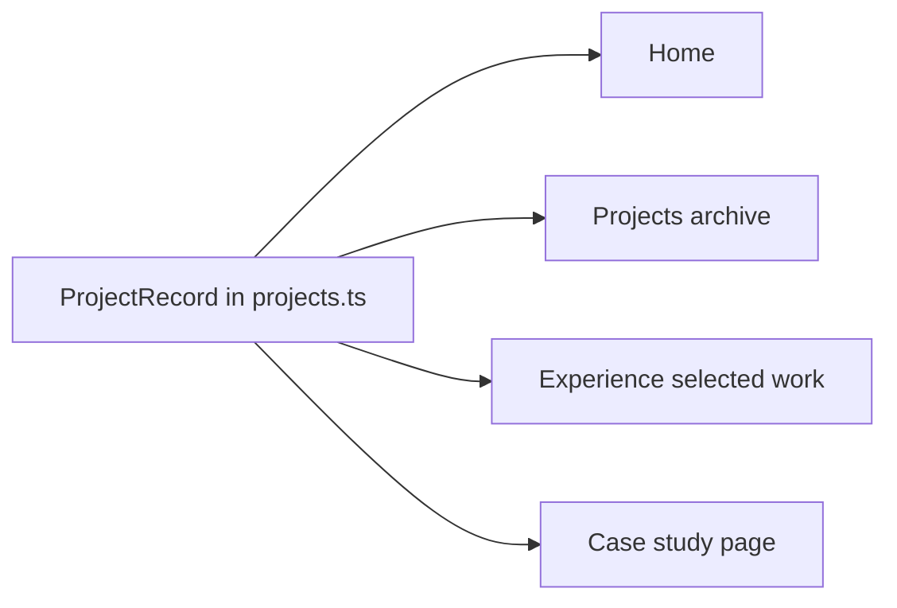

# Project Record (Ficha) Model

This guide describes the portfolio's shared project ficha as it exists in the current feature work. A project is authored once in `src/data/projects.ts`; public pages read the fields they need from that record. The record is not a class template that is copied per page: it is the canonical content object for one project.

## Catalog integration — 2026-10-05

The merge into feature 006 preserves the canonical `projectRecords` model and migrates the reviewed catalog copy into each record. There is no separate `catalogEditorialById`, facts map, narrative map, or per-page media-source allowlist. Home, archive, cases and Experience resolve the same records; shared summary, context, type, period and contribution now use the reviewed values. Case-specific stories, hero presentation and documented boundaries remain in `caseStudy`.

- `workContext` stores the previously verified professional/independent/study facet.
- `technologies` stores verified technology facts and is not inferred from product tags. For the portfolio's Technology filter, use one canonical `Unity` tag for confirmed Unity engine/stack facts, regardless of version; do not expose Unity versions as separate filter options or maintain a version registry. Preserve a confirmed exact version such as Unity 6 in project details only when that fact is intentionally displayed. This rule supersedes the earlier note that Unity and Unity 6 were separate pending taxonomy work.
- `technicalHighlights` and optional `contributionOutcome` extend the shared contribution text for the catalog's Selected contributions section. No unsupported outcome was added.
- `projectsIndexTitleIcon` is the canonical compact identity-icon path shared by the catalog and Featured when applicable; it is not the primary poster path. `catalogIconReuseApproved` records reuse approval for that exact icon on that record, not independent rights verification. See [Compact Project Identity Icon Standard](project-icon-standard.md).
- `media[].catalogReuseApproved` records reuse approval on each existing catalog media item. It is not a legal rights/provenance audit; future media do not inherit approval. For animated previews, keep the static fallback in `src` and put the animation in `previewSrc`.

The archive reads those fields directly, preserves the compact two-column entry and full-width expanded details, and omits media without the scoped reuse approval. Publication and case CTAs still require `portfolioIncluded` and a publishable `caseStudy`. Excluded projects remain excluded. The merge does not implement other recommendations from the hiring review.

## Shared interface icon standard

Use the shared SVG icon component for interface arrows and disclosure plus/minus marks. Preserve arrows used as prose or diagram notation. See [Interface Icon Standard](interface-icon-standard.md) for SVG geometry, accessibility, sizing, and review criteria.

## How the information flows



The project record owns shared facts and an optional `caseStudy` area. That area groups its route, case-specific presentation, narrative, diagrams, evidence, and reflection inside the same project record. Home, archive, experience, and case-study pages resolve their content from this canonical record.

Employment history in `src/data/experience.ts` stores project IDs, not copied project destinations. A short `label` preserves the wording chosen for the Experience section; when no label is set, use the canonical project name. For an included record with an `archiveCategory`, every Selected work reference links to its All Projects entry at `/projects/#${anchorId ?? id}`, whether or not it has a case study. Do not redirect Selected work to a case-study route. If the record is absent, excluded, or has no archive placement, keep the available label/name as plain text without a project link.

## Project record fields

`ProjectRecord` is declared in `src/data/projects.ts`. `id`, `name`, and `summary` identify the record and describe the project. The rest of the fields are optional unless noted below.

| Field | Purpose | Behavior when absent |
| --- | --- | --- |
| `id` | Stable unique project identity used by references | Required; keep it when a display name changes |
| `name` | Public project name | Required |
| `summary` | Shared product/project description | Required |
| `portfolioIncluded` | Whether project-specific content is publicly consumable | Only `true` opts in; missing and `false` mean hidden |
| `archiveCategory` | Archive section | No archive placement |
| `homePlacement` | `featured` or `supporting` Home section | No Home placement |
| `homeOrder`, `archiveOrder` | Order within the relevant surface/group | Existing fallback ordering applies |
| `caseStudy` | Optional case-study area; publishing it requires a slug and at least two stories with non-empty titles and framings | No case-study CTA or generated route unless these requirements are met |
| `type`, `context`, `period` | Classification and context | Omit the unavailable detail |
| `contribution`, `engineeringFocus` | What the author contributed and technical focus | Omit the section |
| `tags`, `specs` | Short descriptors and labeled facts | Omit empty lists/rows |
| `media` | Ordered project media entries | No media block |
| `actions` | Declared non-case-study destinations and labels | No action links |
| `archivePresentation` | Existing `rich`, `standard`, or `compact` archive treatment | `compact` |
| `anchorId` | Existing public archive anchor when it differs from `id` | Use the stable project identity |
| `projectsIndexTitleIcon` | Canonical compact identity icon shown beside a project title in the catalog and reused in Featured when applicable | No icon |
| `mediaCaption`, `evidenceLabel`, `kind` | Optional media/presentation context | Omit or use the shared neutral treatment |

The initial adoption sets `portfolioIncluded` explicitly for every current record, even though the shared rule treats any missing value as hidden. This protects the current public portfolio membership while making new records unpublished until deliberately included.

## Compact identity icon

Follow [project-icon-standard.md](project-icon-standard.md) for asset creation, naming, approval, optical centering, accessibility, and visual QA. Use a 104 × 104 WebP derivative displayed at 52 × 52 CSS px. Preserve original poster/source art and use the same canonical path in catalog and Featured. Omit an absent or unapproved icon without reserving space.

## Example ficha

This shortened example is based on the current Read With Ello record. It shows shared facts, a separately declared animation, available actions, case-study capability, visibility, and where the project appears. Optional details not needed by a project can be omitted.

```ts
{
  id: 'read-with-ello',
  name: 'Read With Ello',
  summary: 'A Unity mobile reading product for children...',
  portfolioIncluded: true,
  homePlacement: 'featured',
  homeOrder: 3,
  archiveCategory: 'professional-game',
  archiveOrder: 2,
  archivePresentation: 'rich',
  media: [{
    type: 'image',
    src: '/projects/ello-read/read-with-ello-first-frame.webp',
    previewSrc: '/projects/ello-read/read-with-ello-gameplay-preview.gif',
    autoplayPreview: true,
    alt: 'Read With Ello product poster.',
    previewAlt: 'Read With Ello gameplay preview showing an interactive reading activity.',
    posterFit: 'contain',
  }],
  actions: [
    { href: 'https://apps.apple.com/us/app/read-with-ello/id1536720182', label: 'App Store' },
    { href: 'https://youtu.be/sk9Ob5f1GT8', label: 'Watch Promo' },
  ],
  caseStudy: {
    slug: 'read-with-ello',
    stories: [
      { title: 'Activity sequencing', framing: 'Connecting player input, spoken content, and outcomes.' },
      { title: 'Shared systems', framing: 'Supporting multiple activities with reusable behavior.' },
    ],
    selectedStories: 'These stories highlight focused examples of my contribution.',
    // Other editorial areas are optional when there is no supported content.
    scopeLabel: 'My contribution',
    ownershipLabel: 'My role',
    glanceFields: ['Context', 'Role'],
    reflection: 'The project brought gameplay, content, and feedback into a cohesive reading experience.',
  },
}
```

The example is abbreviated: each story may include fuller narrative, diagrams, and evidence. The case area can also define hero choices, context, boundaries, production, supporting content, evidence links, a next-project destination, and a meta description. These sections are optional when there is no supported content. Projects without a case study omit `caseStudy`; an area with fewer than two stories with non-empty titles and framings remains unpublished and has no CTA or route.

For a case study to be published, `caseStudy.slug` and at least two `stories` are required. Each story requires a non-empty title and framing. The following sections are optional and disappear from the page when omitted:

- Hero presentation and glance fields
- Scope, ownership, contribution heading, and case boundary
- Introductory copy for the selected stories
- Production and supporting-work sections
- Reflection and evidence links
- Next-project destination and meta description

## Media entries and actions

A `ProjectMedia` entry describes one source in the project's `media` list. For `type: 'image'`, `src` is the static image/fallback and optional `previewSrc` is its animation. Keep both paths in the same record; do not use a separate GIF type or a `posterSrc` field. Set `autoplayPreview: true` to load that animation when it enters the existing viewport margin. When the property is false or omitted, the animation loads on hover or keyboard focus of its project link. `alt` describes the static image, and `previewAlt` describes the animation when those are different. Dimensions and `posterFit` describe the image's intended presentation. Every referenced local asset must exist under `public/` in the current branch.

The static source is the fallback for reduced motion, a failed animation, and the time before its configured preview behavior requests the animation. This feature preserves the established behavior from `develop`: some records load near the viewport, while others load on hover or keyboard focus. No separate Play control is presented.

Each `ProjectAction` is an independently declared `{ href, label }` destination. A case-study CTA and route are available when the included record's `caseStudy` area has a slug and at least two stories with non-empty titles and framings. A store or playable build action does not imply that a case study exists.

## Visibility and route rules

1. A missing record or `portfolioIncluded !== true` means no project-specific Home/archive block, action, project link, or generated case-study page.
2. An Experience Selected work reference to an included project with an `archiveCategory` links to `/projects/#${anchorId ?? id}`. Preserve its explicit `label`; otherwise show the canonical project name. This archive destination applies whether or not the project has a case study.
3. If an experience reference points to a missing or excluded project, or an included project without an `archiveCategory`, retain its available label/name as plain text without a project link.
4. An included project appears only on the surfaces selected by `homePlacement` and/or `archiveCategory`.
5. A case-study link requires `caseStudy.slug` and at least two stories with non-empty titles and framings in the same included project record; the other case sections may be omitted when they have no supported content.
6. External actions remain available when declared, even when a case study is absent, provided the project itself is included.
7. Keep `id`, `caseStudy.slug`, and existing `anchorId` stable to preserve references and public URLs.

## Adding or updating a record

1. Find the project by stable `id` in `projectRecords`; edit shared facts there rather than copying them into a component or page.
2. Set `portfolioIncluded` explicitly. Use `false` while work is incomplete, under maintenance, or not approved for public display.
3. Set Home placement and archive category separately. Set each ordering field when the location in that surface matters.
4. Add only evidence-backed optional facts and actions. Leave unavailable fields absent instead of using placeholder text.
5. Point `media.src` and optional `previewSrc` at existing assets. Use the right static visual for that project and retain a meaningful fallback/alternative description.
6. Add case-study presentation, stories, narrative, and evidence inside that record's `caseStudy` area. Add at least two stories with non-empty titles and framings, and keep its slug stable to publish/preserve the public route. Omit optional editorial sections when there is no supported content.
7. Add or update experience references with the stable `projectId`; keep an experience `label` only when that surface intentionally uses different wording.
8. When adding a model field, make it optional or document a safe default, update the relevant consumer, and ensure records that omit it continue to render without empty UI.

## Current consumer map

| Surface | Consumer | Shared information |
| --- | --- | --- |
| Home featured work | `src/components/FeaturedProject.astro` | Project name, summary, contribution, media, case-study/action links |
| Home supporting work | `src/components/SupportingProject.astro` | Project name, optional detail, media, actions, archive destination |
| All Projects page | `src/components/ProjectRecord.astro`, `src/components/RichProjectRecord.astro` | Summary, metadata, contribution, media, actions, and optional title icon |
| Catalog media-entry identity | `ProjectRecord.astro` / `.archive-record__identity-link` | One link wraps the optional decorative icon and project title and targets the stable record hash; media, summary, details and actions remain separate |
| Experience Selected work | `src/components/ExperienceEntry.astro`, `resolveExperienceWork`, and `resolveProjectArchiveHref` | Explicit reference label (otherwise canonical project name); included archive projects link to `/projects/#${anchorId ?? id}`, with plain-text fallback when missing, excluded, or not placed in the archive |
| Case study | `src/pages/work/[slug].astro` plus case-specific story components | Canonical project facts/media and the nested case-study sections |

## Current branch repair

When the feature work was reapplied on top of the current `develop`, several poster and narrative image paths still ended in `.png`, while the current assets had been converted to `.webp`. Project and nested case-study media references in `src/data/projects.ts` now use the available `.webp` assets. The spec's media requirements include checking referenced files so future asset format changes do not leave broken images behind.


For catalog entries rendered by `ProjectRecord.astro`, the compact identity is one `.archive-record__identity-link` around the optional icon and heading, targeting the same stable project fragment. Keep the entire identity composition clickable, keep the icon decorative when the title repeats its meaning, and do not wrap the media, description, disclosures, or detail links. Preserve keyboard focus visibility. Runtime acceptance is SC-033 in feature 006.
